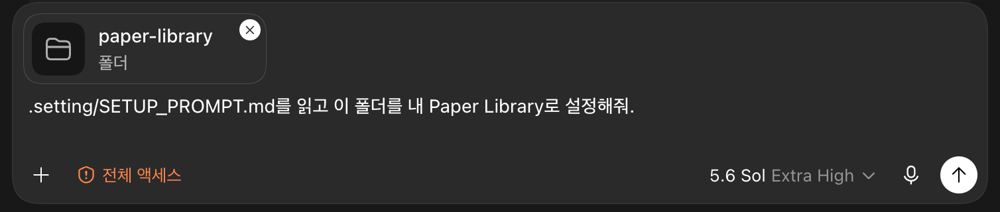

# Paper Library

PDF를 폴더에 넣고 기다리면 Codex가 논문을 읽고, 정보를 확인하고, 분야별로 정리해 주는 macOS 앱입니다.

<p align="center">
  
</p>

현재는 소수 사용자를 위한 초기 베타 버전입니다. **macOS 14 이상이 설치된 Apple Silicon Mac**과 **Codex**가 필요합니다.

## 처음 시작하기

### 1. Paper Library 폴더 받기

1. [Paper Library 폴더 다운로드](https://github.com/hoonably/paper-library/archive/refs/heads/main.zip)를 누릅니다.
2. 받은 ZIP의 압축을 풀고, 나온 `paper-library-main` 폴더를 원하는 위치에 둡니다. 폴더 이름은 원하는 대로 바꿔도 됩니다.

이 폴더에는 앱이 아니라 **논문과 자동화 설정**이 저장됩니다. 아래에서는 이 폴더를 Paper Library 폴더라고 부릅니다. 이름과 위치는 자동화 설정 전에 정하고, 다른 Mac과 동기화할 때는 폴더 전체를 동기화하세요.

### 2. Codex 자동화 설정하기

1. Codex에서 방금 준비한 Paper Library 폴더를 엽니다.
2. 이 폴더에 **Full Access**를 허용합니다.
3. 아래 문장을 그대로 복사해 Codex에 보냅니다.

```text
.setting/SETUP_PROMPT.md를 읽고 이 폴더를 내 Paper Library로 설정해줘.
```

폴더가 첨부되어 있고 **전체 액세스**가 표시된 상태에서 보내면 됩니다.

<p align="center">
  
</p>

4. Codex가 설치와 확인을 마쳤다고 알려줄 때까지 기다립니다. 이 Mac이 새 PDF를 처리하는 **자동화 Mac**이 됩니다.

### 3. 앱 설치하고 처음 열기

1. [GitHub Releases](https://github.com/hoonably/paper-library/releases)에서 가장 최신 버전의 `Paper-Library.zip`을 받습니다.
2. 압축을 풀고 `Paper Library.app`을 **응용 프로그램** 폴더로 옮깁니다.
3. 앱을 더블 클릭합니다.

현재 앱은 Apple의 유료 서명과 공증을 받지 않았기 때문에 macOS가 처음 실행을 차단합니다. 앱을 한 번 열어 본 다음 아래 순서로 허용하세요.

1. **시스템 설정 → 개인정보 보호 및 보안**으로 이동합니다.
2. 아래로 내려가 Paper Library 옆의 **그래도 열기**를 누릅니다.

<p align="center">
  
</p>

한 번 허용하면 다음부터는 앱을 평소처럼 열 수 있습니다.

### 4. 앱에 폴더 연결하기

앱이 처음 열리면 1단계에서 준비한 Paper Library 폴더를 선택합니다. `.setting`, `.catalog`, `paper`가 들어 있는 **가장 바깥쪽 폴더**를 선택해야 합니다. `paper` 하위 폴더를 선택하면 안 됩니다.

### 5. PDF 한 개로 확인하기

새 PDF를 `Paper Library` 폴더의 가장 바깥쪽에 넣고 기다립니다.

```text
원하는 폴더 이름/
├── 새로 받은 논문.pdf    ← 여기에 넣기
├── .catalog/
├── .setting/
└── paper/
    └── 분야별 폴더/      ← 처리가 끝나면 자동으로 이동
```

Codex가 논문을 처리하면 PDF가 `paper/분야/` 아래로 이동하고 앱 목록도 자동으로 갱신됩니다. 처음 한 편은 분석과 정보 확인 때문에 시간이 조금 걸릴 수 있습니다.

## 평소에는 이렇게 사용합니다

1. 새 PDF를 `Paper Library` 폴더의 가장 바깥쪽에 넣습니다.
2. 그대로 기다립니다.
3. 정리가 끝나면 앱에서 검색하거나 읽습니다.

드래그하지 않고 옮기려면 Finder에서 PDF를 우클릭한 뒤 **서비스 → Move to Paper Library**를 선택하세요. PDF는 복사되지 않고 Paper Library 폴더로 이동합니다.

<details>
<summary><strong>여러 Mac에서 사용하기</strong></summary>

전체 `Paper Library` 폴더를 iCloud Drive나 Dropbox 등으로 동기화하고, 자동화는 **한 대의 Mac에만** 설치합니다.

다른 Mac에서는 앱만 설치한 뒤 동기화된 `Paper Library` 폴더를 선택하면 됩니다. 자동화를 다른 Mac으로 완전히 옮길 때만 새 Mac에서 아래 문장을 Codex에 보내세요.

```text
이 Paper Library의 자동화를 현재 Mac으로 완전히 이전해줘. 필요하면 .setting/SETUP_PROMPT.md를 읽고 --take-over 절차를 사용해줘.
```

</details>
