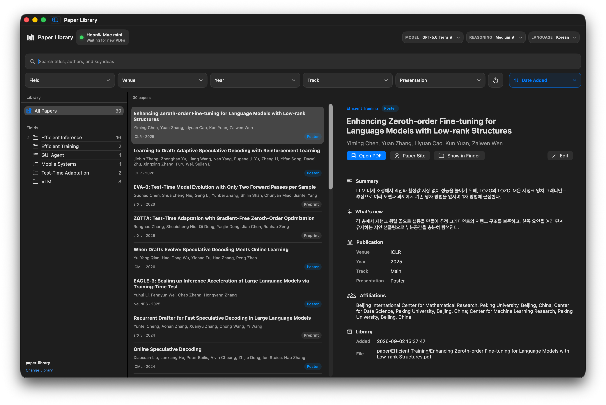
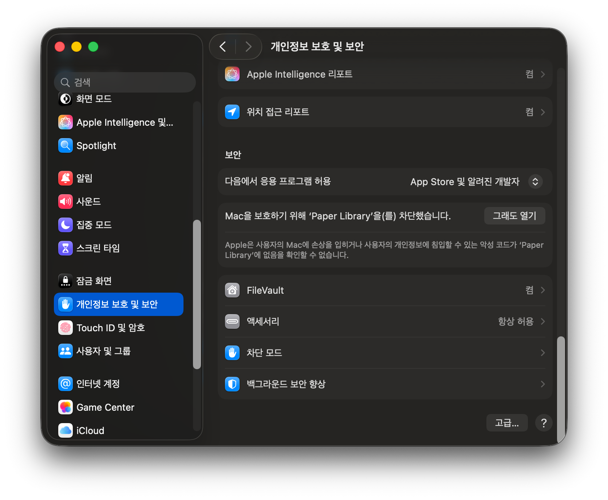
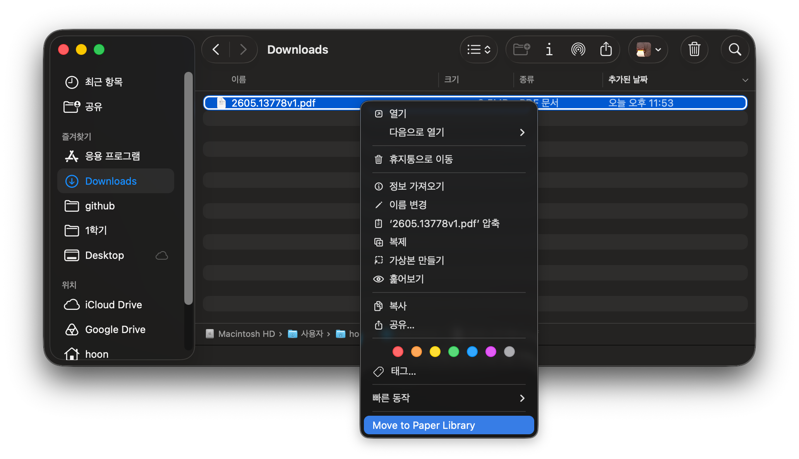

# Paper Library

Finder에서 PDF를 바로 추가하면 Codex가 읽고 확인한 뒤 분야별로 정리해 주는 macOS 앱입니다.

  

현재는 소수 사용자를 위한 초기 베타 버전입니다. **macOS 14 이상이 설치된 Apple Silicon Mac**과 로그인된 **Codex CLI**가 필요합니다.

## 처음 시작하기

1. [GitHub Releases](https://github.com/hoonably/paper-library/releases)에서 `Paper-Library.zip`을 받습니다.
2. 압축을 풀고 `Paper Library.app`을 **응용 프로그램** 폴더로 옮깁니다.
3. 앱을 한 번 실행합니다.

macOS가 실행을 막으면 **시스템 설정 → 개인정보 보호 및 보안 → 그래도 열기**를 누릅니다.

  

4. 처음 표시되는 설정 화면에서 언어를 선택합니다.
5. 로그인이 필요하면 **Sign In**을 누르고 브라우저에서 로그인합니다.
6. **Codex CLI is ready**가 표시되면 **Start Automation**을 누릅니다.

Git 저장소나 소스 코드는 받을 필요가 없습니다. 필요한 파일과 논문은 앱이 macOS의 전용 저장소에 자동으로 만듭니다.

현재 버전의 라이브러리는 설정한 **이 Mac에만** 저장됩니다. 앱을 업데이트해도 기존 논문과 목록은 유지됩니다.

## PDF 추가하기

Finder에서 PDF를 우클릭한 뒤 **서비스 → Move to Paper Library**를 누릅니다.

  

PDF는 복사되지 않고 앱의 `Waiting` 공간으로 이동합니다. 처리가 끝나면 앱 목록이 자동으로 갱신됩니다. 앱 창은 열리지 않습니다.
